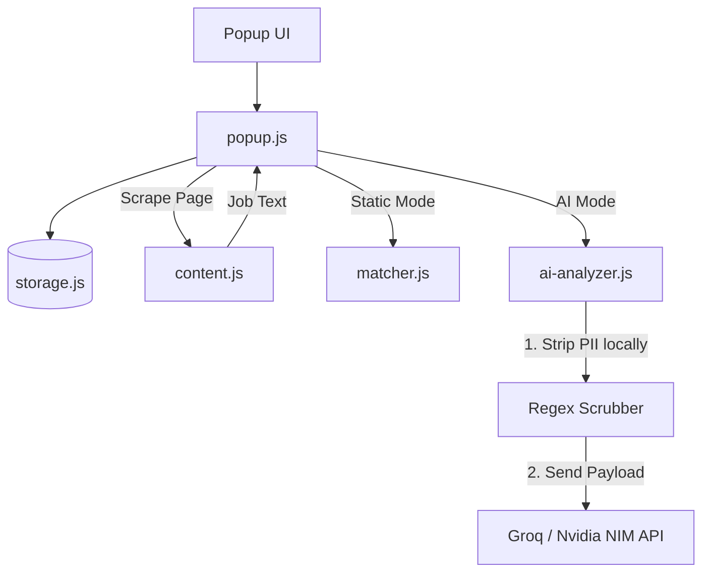

# 📄 Resume Match Score

## 📖 The Story: Why I Built This

Job hunting is famously described as a "black box." You spend hours tailoring your resume, submit it into an ATS (Applicant Tracking System), and then... silence. I realized the core problem wasn't a lack of qualifications, but a lack of *immediate feedback* on how a resume aligns with the specific language of a job posting. 

I wanted to build a tool that solves this by acting as a personal application assistant. My goals were strictly defined:
1. **Zero Friction:** It had to work directly in the browser while looking at a job posting. No copy-pasting back and forth between AI chat windows.
2. **Absolute Privacy:** Resumes contain highly sensitive Personally Identifiable Information (PII). Sending raw resumes to cloud APIs is a major privacy violation.
3. **Actionable Insights:** It shouldn't just say "70% match". It needs to highlight missing skills, assess strengths, and suggest actionable ways to improve the resume.

The result is **Resume Match Score**, a Chrome Extension with a dual-engine architecture that provides deep, AI-driven context analysis while rigorously defending user privacy through local, browser-based sanitization.

---

## 🛠️ The Technical Challenges (And How I Solved Them)

Building an AI-integrated Chrome Extension presented several unique engineering challenges which I tackled iteratively:

### 1. The Privacy Challenge: Sanitizing Data Before the Cloud
LLMs are incredible at semantic matching, but I refused to send user emails, phone numbers, and names to third-party APIs.
**The Solution:** I engineered a local Regex-based PII scrubber (`ai-analyzer.js`) that runs entirely within the browser. Before a single byte of data is sent to the LLM, the extension parses the resume text, detects patterns (emails, URLs, phone numbers), and dynamically infers and strips the candidate's name from the document header. Users can click "View Shared Data" to transparently audit the exact, sanitized prompt being sent.

### 2. The Cost Challenge: Keeping It Free
Most AI tools charge monthly subscriptions to cover backend API costs. I wanted this to remain free and accessible.
**The Solution:** I architected a **Bring-Your-Own-Key (BYOK)** system and integrated with high-performance, free-tier LLM providers: **Groq** (Llama 3) and **Nvidia NIM**. The user simply pastes their free API key, which is securely stored in Chrome's `local.storage` and used directly for requests. There is no backend server, no database, and no recurring infrastructure costs.

### 3. The Reliability Challenge: Unpredictable LLM Outputs
LLMs often hallucinate formatting or return conversational fluff (e.g., "Here is your analysis..."), which breaks UI rendering.
**The Solution:** I utilized strict JSON schema prompting. By heavily optimizing the system prompt, I forced the LLMs to return a highly structured JSON response. I then built robust parsing logic that catches and recovers from malformed arrays or missing fields (like defaulting missing `strengths` arrays) before rendering the UI components.

---

## ✨ Key Features

- **Instant Match Scoring:** Instantly calculates a 0-100 score on how well your resume matches the job description on the screen.
- **AI-Powered Deep Insights:** Receive a "PRIORITISE", "CONSIDER", or "PASS" verdict, along with an honest take on your candidacy.
- **Actionable Suggestions:** Generates specific tips on how to improve your resume for the role, complete with UI skill chips.
- **Cold Email Generator:** Automatically generates a tailored cold email referencing the exact skills that match the role.
- **Privacy First:** Automated guardrails instantly strip PII before sending data to the cloud.
- **Premium UI:** Features dark mode support and a lightweight CSS 3D Cube animation for processing states.

---

## 🏗️ Project Architecture

### File Breakdown
- **`manifest.json`**: Extension configuration (Manifest V3), strict host permissions for APIs.
- **`popup.html` & `popup.css`**: The Single Page Application UI, built with modern CSS and Material Design tokens.
- **`popup.js` & `ui-utils.js`**: Core UI controllers, DOM manipulation, and state management.
- **`content.js`**: Scrapes the job description from the active tab.
- **`ai-analyzer.js`**: Orchestrates PII stripping, prompt engineering, JSON parsing, and LLM communication.
- **`storage.js`**: Async wrapper for Chrome local storage API.

---

## 🚀 Installation & Setup

Because this extension is a portfolio project, it is installed locally via Developer Mode.

1. **Download the code:** Clone or download this repository.
2. **Open Chrome Extensions:** Go to `chrome://extensions/` in your browser.
3. **Enable Developer Mode:** Toggle the switch in the top right corner.
4. **Load the Extension:** Click **Load unpacked** and select the `resume-match-score` folder.
5. **Pin it:** Click the puzzle piece icon 🧩 and pin the extension!

### ⚙️ Setting up the AI (Free)
1. Open the extension and toggle to **AI Mode**.
2. Click the **Settings Gear (⚙)**.
3. Select your provider (e.g., **Nvidia NIM API** or **Groq**).
4. Click the link to generate a free API key, paste it into the extension, and click **Test**.

---

## 🤝 Contributing
Contributions are welcome! Please feel free to submit a Pull Request.

## 📄 License
This project is licensed under the MIT License - see the LICENSE file for details.

---

  <b>⭐ If you find this extension helpful, please consider giving it a star on <a href="https://github.com/sivaprasathm93/resume-match-score">GitHub</a>! ⭐</b>  
  Built with ❤️ by <b>Sivaprasath Mohandass</b>

