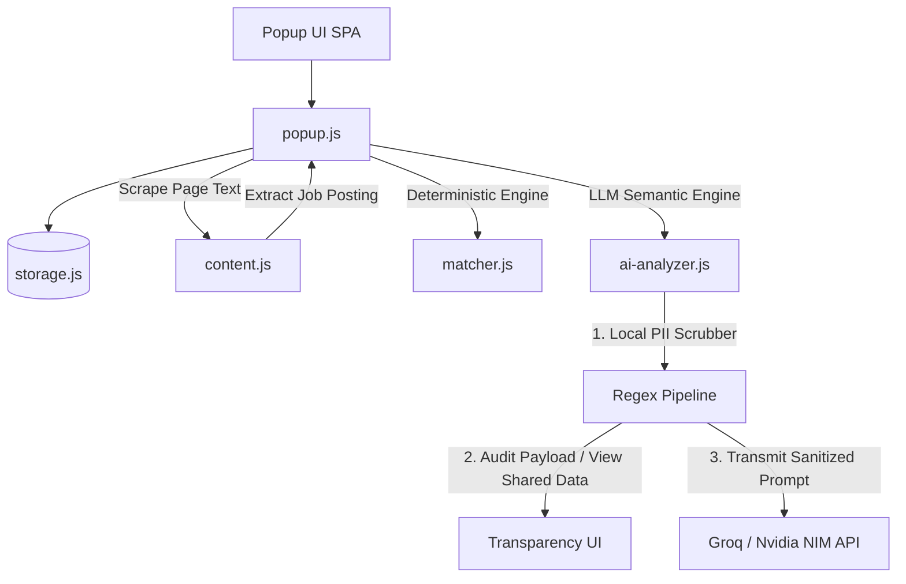

# 📄 Resume Match Score


**Resume Match Score** is an AI-powered Chrome Extension engineered to bridge the gap between job seekers and Applicant Tracking Systems (ATS). By performing instant, privacy-preserved semantic matching between a candidate's resume and live job descriptions, it delivers real-time, actionable insights directly within the browser.

---

## 📖 The Story: Why I Built This

Job hunting often feels like sending your resume into a "black box." Candidates spend countless hours tailoring applications, submitting them into automated screening systems, and waiting in silence. The core friction isn't a lack of candidate potential—it's the absence of **immediate, objective feedback** on how closely a resume mirrors the explicit requirements and domain language of a target role.

To solve this, I designed **Resume Match Score** as an intelligent, context-aware co-pilot with three uncompromising engineering principles:

1. **Zero-Context-Switching Workflow:** Operates natively inside the active browser tab while viewing any job listing, eliminating manual copy-pasting into external AI chat interfaces.
2. **Privacy-First Data Guardrails:** Resumes contain sensitive Personally Identifiable Information (PII). Transmitting raw candidate data to third-party cloud APIs poses significant privacy risks. Sanitization must happen locally *before* external transmission.
3. **Actionable, Multidimensional Feedback:** Moves beyond naive keyword matching to provide qualitative fit badges, missing critical skill flags, concrete suggestions, and recruiter outreach drafts.

---

## 🛠️ Key Technical Challenges & Solutions

Designing a client-side AI browser extension required tackling several non-trivial engineering constraints:

### 1. Client-Side PII Sanitization & Full Payload Transparency
* **Challenge:** Preventing sensitive personal data (full name, phone numbers, email addresses, personal links) from leaking to third-party LLM providers while giving users 100% visibility.
* **Solution:** Developed an in-browser Regex-based scrubbing pipeline (`ai-analyzer.js`). Before any payload leaves the client, the extension parses the resume text, detects contact patterns, and dynamically infers and redacts the candidate's name from header blocks. Additionally, built an interactive **"View Shared Data" Modal** allowing candidates to audit the exact sanitized prompt, resume snippet, and job text sent to the LLM.

### 2. Universal Job Board Adaptability ("Support This Page")
* **Challenge:** Job postings exist across hundreds of ATS platforms and company career portals, making static hardcoded domain lists insufficient.
* **Solution:** Engineered a dynamic URL pattern manager. If a candidate visits an unlisted niche job portal or custom career site, they can click **"Support This Page"** to instantly whitelist the domain into their `chrome.storage` allowed patterns list, giving them immediate single-click parsing capability anywhere on the web.

### 3. Zero-Cost, BYOK (Bring-Your-Own-Key) Architecture
* **Challenge:** Avoiding costly backend server infrastructure and recurring subscription paywalls for users.
* **Solution:** Implemented a decoupled, serverless client model using Chrome's secure `chrome.storage` API. Integrated high-throughput, free-tier LLM endpoints (**Groq / Llama 3** and **Nvidia NIM**). The extension executes requests directly from the client, eliminating API middleman latency and backend operating expenses.

### 4. Structured JSON Enforcement & Resilient Parsing
* **Challenge:** LLM output drift, conversational prefixing, or invalid JSON structures causing client UI rendering crashes.
* **Solution:** Engineered strict system prompts enforcing structured JSON schemas. Paired this with a resilient parsing wrapper that validates schema signatures, sanitizes raw string responses, and gracefully injects structural fallbacks (e.g., handling missing or malformed array fields) to guarantee UI stability.

---

## ✨ Key Features

- 🎯 **Instant Match Rating:** Computes a normalized 0–100 alignment score comparing candidate qualifications against job requirements.
- 💡 **Qualitative AI Verdicts:** Generates executive fit ratings (`PRIORITISE`, `CONSIDER`, or `PASS`) accompanied by a concise synthesis of strengths and gaps.
- 🛠️ **Skill Gap Breakdown:** Distinguishes between required and preferred skills, rendering interactive UI chips for missing competencies.
- 🌐 **Custom Job Board Whitelisting ("Support This Page"):** Empowers candidates to add any unsupported job site domain directly into their local allowed patterns list with one click.
- 👁️ **Full LLM Payload Transparency:** Includes a dedicated **"View Shared Data"** modal displaying the exact sanitized prompt payload, prompt length, and LLM model name.
- ✉️ **Targeted Cold Email Generator:** Auto-drafts tailored outreach messages to recruiters, highlighting candidate alignment for the specific role.
- 🚫 **Fluff Word Management:** Custom excluded keyword list to prevent generic buzzwords (e.g., "teamwork", "leadership") from skewing skill scores.
- 🎨 **Modern SPA Experience:** Polished Material Design interface featuring dark mode support and custom CSS steam-train animation for processing states.

---

## 🏗️ System Architecture



### Modular Codebase Structure
- **`manifest.json`**: Chrome Extension Manifest V3 configuration defining active tab permissions and API host permissions.
- **`popup.html` & `popup.css`**: Responsive Single Page Application UI built with modern CSS custom properties and dynamic layout tokens.
- **`popup.js` & `ui-utils.js`**: Core UI state manager, event dispatchers, view router, modal controllers, and domain whitelisting logic.
- **`content.js`**: DOM scraper extracting raw job description text from target web pages.
- **`ai-analyzer.js`**: PII sanitization engine, prompt template builder, schema validator, and LLM API client.
- **`matcher.js`**: Local deterministic keyword and n-gram similarity engine for offline scoring.
- **`storage.js`**: Promise-based wrapper around `chrome.storage.local` managing API keys, allowed domain patterns, and fluff word filters.

---

## 🚀 Installation & Setup

### 1. Load Extension in Developer Mode
1. Clone or download this repository locally:
   ```bash
   git clone https://github.com/sivaprasathm93/resume-match-score.git
   ```
2. Navigate to `chrome://extensions/` in Google Chrome.
3. Enable **Developer mode** using the toggle switch in the top-right corner.
4. Click **Load unpacked** and select the root directory of the cloned repository.
5. Pin **Resume Match Score** to your browser toolbar for quick access.

### 2. Configure Free AI Credentials
1. Click the extension icon and toggle to **AI Mode**.
2. Click the **Settings (⚙)** icon.
3. Choose your preferred AI Provider (**Groq** or **Nvidia NIM**).
4. Obtain a free API key using the provided quick-link, paste it into the field, and click **Test & Save**.

---

## 🤝 Contributing
Contributions, issues, and feature requests are welcome! Feel free to check the [issues page](https://github.com/sivaprasathm93/resume-match-score/issues).

## 📄 License
This project is licensed under the [MIT License](LICENSE).

---

<div align="center">
  <b>⭐ If you find this project useful, please consider giving it a star on <a href="https://github.com/sivaprasathm93/resume-match-score">GitHub</a>! ⭐</b><br><br>
  Designed & Built with ❤️ by <b>Sivaprasath Mohandass</b>
</div>


